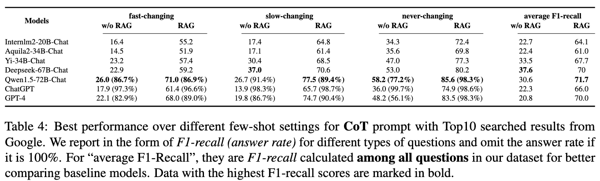

# CDQA: Chinese Dynamic Question Answering Benchmark
<div align="center">
<div>
Zhikun Xu*, Yinghui Li*, Ruixue Ding†, Xinyu Wang, Boli Chen, Yong Jiang†, Hai-Tao Zheng, Wenlian Lu, Pengjun Xie, Fei Huang
</div>
<div>
<strong>Institute for Intelligent Computing, Alibaba Group</strong>
</div>
<div>
*Equal Contribution; †Corresponding Author
</div>


[](https://arxiv.org/abs/2402.19248)
</div>

We propose a Chinese QA benchmark containing question-answer pairs related to the latest news on the Chinese Internet by the following semi-automatic generation pipeline.


Besides, questions and answers are carefully categorized according to the frequency of answer changes and predefined answer types. Our contribution is for better evaluating Chinese-oriented LLMs, preventing the data contamination during evaluation with periodic updates on answers.


## Dataset Summary
The following tables are evaluation results for different baseline models. For searched results, we use Google by default. For prompts, we use three types: **Vanilla**, **Chain-of-Thought** and **Rephrase-and-Respond**. 




## Citation

If you found this work useful, consider giving this repository a star and citing our paper as followed:

```
@misc{xu2024let,
      title={Let LLMs Take on the Latest Challenges! A Chinese Dynamic Question Answering Benchmark}, 
      author={Zhikun Xu, Yinghui Li, Ruixue Ding, Xinyu Wang, Boli Chen, Yong Jiang, Hai-Tao Zheng, Wenlian Lu, Pengjun Xie, Fei Huang},
      year={2024},
      eprint={2402.19248},
      archivePrefix={arXiv},
      primaryClass={cs.CL}
}
```
