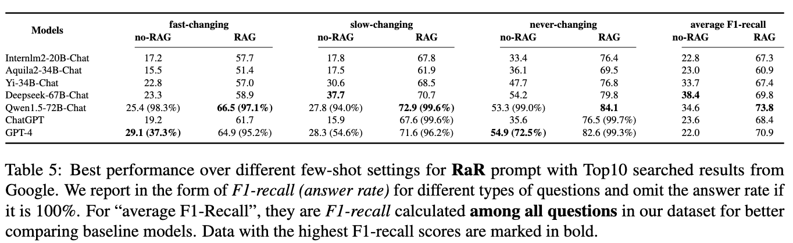

# CDQA: Chinese Dynamic Question Answering Benchmark
This is the repo for paper: Let LLMs Take on the Latest Challenges! A Chinese Dynamic Question Answering Benchmark.

We propose a Chinese QA benchmark containing question-answer pairs related to the latest news on the Chinese Internet by the following semi-automatic generation pipeline.

Besides, questions and answers are carefully categorized according to the frequency of answer changes and predefined answer types. Our contribution is for better evaluating Chinese-oriented LLMs, preventing the data contamination during evaluation with periodic updates on answers.

## Dataset Summary
The following tables are evaluation results for different baseline models. For searched results, we use Google by default. For prompts, we use three types: **Vanilla**, **Chain-of-Thought** and **Rephrase-and-Respond**. 

